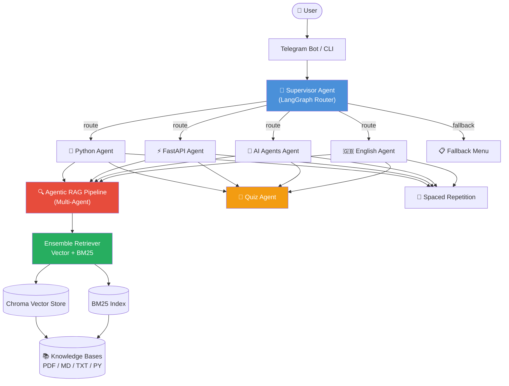
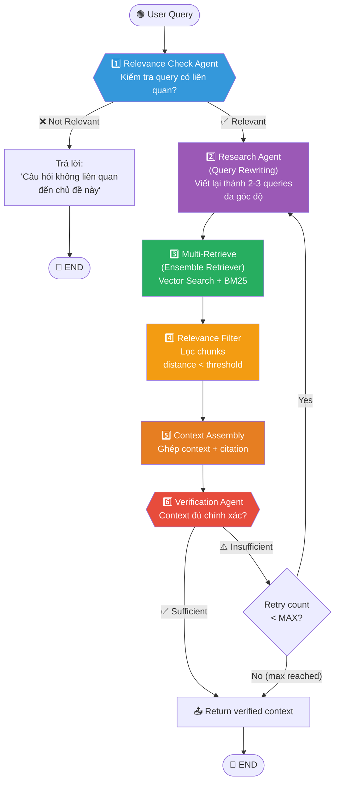
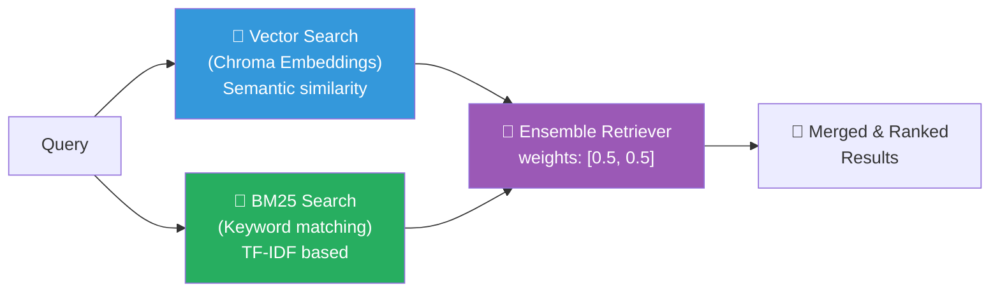
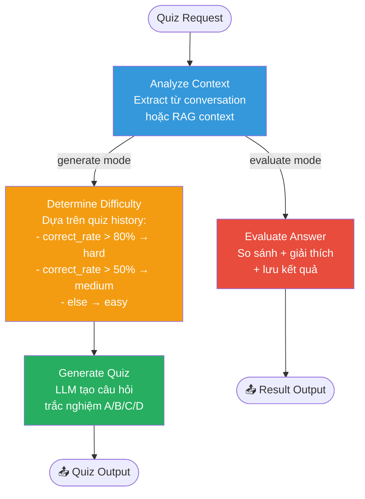
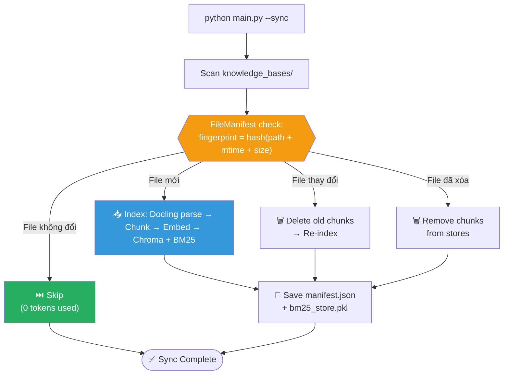

# 🎓 Personal Learning Assistant — Multi-Agent RAG System

> Hệ thống trợ lý học tập thông minh sử dụng **Multi-Agent Architecture** với **Agentic RAG**, **Ensemble Retriever**, và **Quiz Agent**.

## ✨ Tính năng chính

| Feature | Mô tả |
|---------|-------|
| 🤖 **Multi-Agent** | Supervisor route query → domain agents (Python, FastAPI, AI Agents, English) |
| 📄 **Docling PDF** | Parse PDF với table/layout/OCR extraction (fallback PyPDF) |
| 🔍 **Ensemble Retriever** | Kết hợp Vector search (Chroma) + BM25 keyword search |
| ✅ **Relevance Check** | Agent kiểm tra query có liên quan đến domain trước khi tìm kiếm |
| 🔬 **Research Agent** | Viết lại query đa góc độ, multi-retrieval thông minh |
| 🛡️ **Verification Agent** | Xác minh context đủ chính xác trước khi trả lời, auto-retry nếu không đủ |
| 🧠 **Quiz Agent** | Tạo quiz từ nội dung đang hỏi đáp, adaptive difficulty |
| 📦 **Smart Embedding** | Incremental indexing — chỉ embed file mới/thay đổi, skip unchanged |
| 📖 **Spaced Repetition** | Hệ thống thẻ nhớ SM-2 |

---

## 🏗️ Kiến trúc tổng quan



---

## 🔍 Luồng Agentic RAG Pipeline (Chi tiết)

Khi user đặt câu hỏi, pipeline sẽ chạy qua **6 agents** theo thứ tự:



### Chi tiết từng Agent:

| # | Agent | Vai trò | Input | Output |
|---|-------|---------|-------|--------|
| 1 | **Relevance Check** | Xác minh query thuộc domain | query, agent_name | is_relevant, reason |
| 2 | **Research Agent** | Viết lại query đa góc độ | query, retry_notes | 2-3 rewritten queries |
| 3 | **Multi-Retrieve** | Ensemble search (Vector + BM25) | queries | raw_chunks (deduplicated) |
| 4 | **Relevance Filter** | Lọc chunks theo distance score | raw_chunks, query | filtered_chunks |
| 5 | **Context Assembly** | Ghép chunks + thêm citation | filtered_chunks | structured context |
| 6 | **Verification Agent** | Kiểm tra tính đầy đủ, chính xác | context, query | pass/fail + notes |

---

## 🔀 Ensemble Retriever

Kết hợp 2 phương pháp search để tăng recall:



| Retriever | Ưu điểm | Nhược điểm |
|-----------|---------|------------|
| **Vector (Chroma)** | Hiểu semantic meaning, tìm được paraphrase | Miss exact keywords |
| **BM25** | Chính xác với keyword/term cụ thể | Không hiểu semantic |
| **Ensemble** | Kết hợp cả hai → recall cao hơn | Chậm hơn chút |

---

## 🧠 Quiz Agent

Quiz Agent tạo quiz thông minh dựa trên nội dung đang hỏi đáp:



---

## 📦 Smart Embedding (Incremental Indexing)

Hệ thống **không embed lại** file đã có — tiết kiệm token và thời gian:



---

## 📁 Cấu trúc dự án

```
PersonalLearningAssistant/
├── main.py                    # Entry point (bot / CLI / sync / status)
├── bot.py                     # Telegram Bot interface
├── supervisor.py              # Supervisor Agent (LangGraph router)
├── requirements.txt           # Dependencies
├── .env                       # API keys & config
│
├── agents/
│   ├── base_agent.py          # Base class (RAG + Quiz + Review + Tools)
│   ├── learning_agents.py     # Domain agents (Python, FastAPI, AI, English)
│   └── quiz_agent.py          # 🆕 Dedicated Quiz Agent
│
├── rag/
│   ├── rag_engine.py          # RAG Engine (Docling + Ensemble + Manifest)
│   └── agentic_rag.py         # Multi-Agent RAG pipeline
│
├── tools/
│   └── learning_tools.py      # Quiz gen, Spaced Repetition, Stats
│
├── config/
│   └── settings.py            # Central configuration
│
├── knowledge_bases/           # 📚 Tài liệu học tập (PDF, MD, TXT, PY)
│   ├── python/
│   ├── fastapi/
│   ├── ai_agents/
│   └── english/
│
├── vector_stores/             # 💾 Chroma + BM25 + Manifest (auto-generated)
│   ├── python/
│   │   ├── manifest.json      # File tracking
│   │   └── bm25_store.pkl     # BM25 index
│   └── ...
│
└── data/
    └── learning.db            # SQLite (quiz results, flashcards)
```

---

## 🚀 Cài đặt & Sử dụng

### 1. Cài đặt

```bash
pip install -r requirements.txt
```

### 2. Cấu hình `.env`

```env
OPENAI_API_KEY=sk-...
LLM_MODEL=gpt-4o-mini
EMBEDDING_MODEL=text-embedding-3-small
TELEGRAM_BOT_TOKEN=...
TELEGRAM_CHAT_ID=...
```

### 3. Thêm tài liệu vào Knowledge Base

```bash
# Copy PDF/MD/TXT vào thư mục tương ứng
cp my_python_book.pdf knowledge_bases/python/
cp fastapi_docs.md knowledge_bases/fastapi/
```

### 4. Sync & chạy

```bash
# Sync tài liệu (chỉ embed file mới/thay đổi)
python main.py --sync

# Xem trạng thái
python main.py --status

# Test qua CLI
python main.py --cli

# Chạy Telegram bot
python main.py
```

### 5. Commands

| Command | Mô tả |
|---------|--------|
| `python main.py` | Chạy Telegram bot |
| `python main.py --cli` | Test qua CLI |
| `python main.py --sync` | Sync tất cả knowledge bases |
| `python main.py --sync python` | Sync 1 agent cụ thể |
| `python main.py --status` | Xem trạng thái KB |
| `python main.py --reindex python` | Force reindex (xóa hết, embed lại) |

---

## 💬 Ví dụ sử dụng

```
You: Giải thích async/await trong Python

[python]: 
  1️⃣ Relevance Check    ✅ Relevant (Python concept)
  2️⃣ Research Agent      → 3 queries generated
  3️⃣ Ensemble Retrieve   → 8 unique chunks (Vector + BM25)
  4️⃣ Filter              → 5 chunks passed
  5️⃣ Assembly            → Context from "PYTHON PROGRAMMING NOTES.pdf"
  6️⃣ Verification        ✅ Sufficient

  Theo tài liệu "PYTHON PROGRAMMING NOTES.pdf":
  async/await là cú pháp trong Python để viết code bất đồng bộ...
  
  Muốn làm quiz về async/await không?

You: quiz

  🧠 Quiz — async/await (Độ khó: medium)
  
  **Trong Python, từ khóa `await` có thể dùng ở đâu?**
  A. Trong bất kỳ function nào
  B. Chỉ trong async function
  C. Chỉ trong class method
  D. Chỉ trong module level
  
  Reply A, B, C hoặc D

You: B

  ✅ Chính xác!
  💡 Giải thích: `await` chỉ có thể sử dụng bên trong...
```

---

## 🔧 Tech Stack

| Component | Technology |
|-----------|-----------|
| LLM | OpenAI GPT-4o-mini |
| Orchestration | LangGraph (StateGraph) |
| Vector Store | ChromaDB |
| BM25 | rank-bm25 |
| PDF Parser | Docling (fallback: PyPDF) |
| Embeddings | OpenAI text-embedding-3-small |
| Bot | python-telegram-bot |
| Database | SQLite |
